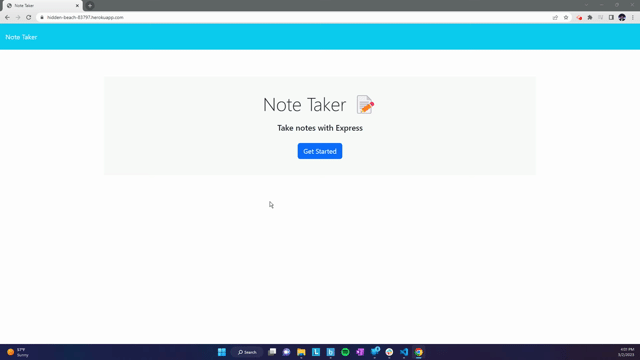

# Note-Taker

## Description

This is a note-taking application that uses an Express.js backend and saves and retrieves note data from a JSON file.

## Usage

Clone the repository to your local development environment and then run npm install for the required dependencies.

To run the application locally, run node server.js in the CLI before opening http://localhost:3001 in your preferred browser. You can also access the application here: https://hidden-beach-83797.herokuapp.com/

## Screenshots:

GIF file showing the adding and deleting of notes.

### Links:

1. Deployed application: https://hidden-beach-83797.herokuapp.com/
2. GitHub repository: https://github.com/XvrTeo/Note-Taker
